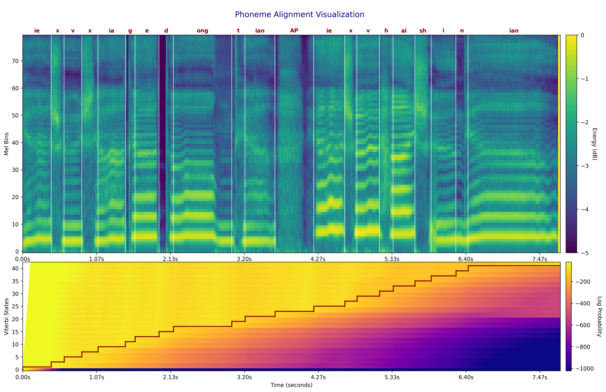

{:.no_toc}
* toc
{:toc}

# Abstract

Recent breakthroughs in singing voice synthesis (SVS) have heightened the demand for high-quality annotated datasets, yet manual annotation remains prohibitively labor-intensive and resource-intensive. Existing automatic singing annotation (ASA) methods, however, primarily tackle isolated aspects of the annotation pipeline. To address this fundamental challenge, we present STARS, which is, to our knowledge, the first unified framework that simultaneously addresses singing transcription, alignment, and refined style annotation. Our framework delivers comprehensive multi-level annotations encompassing: (1) precise phoneme-audio alignment, (2) robust note transcription and temporal localization, (3) expressive vocal technique identification, and (4) global stylistic characterization including emotion and pace. The proposed architecture employs hierarchical acoustic feature processing across frame, word, phoneme, note, and sentence levels. The novel non-autoregressive local acoustic encoders enable structured hierarchical representation learning. Experimental validation confirms the framework's superior performance across multiple evaluation dimensions compared to existing annotation approaches. Furthermore, applications in SVS training demonstrate that models utilizing STARS-annotated data achieve significantly enhanced perceptual naturalness and precise style control. This work not only overcomes critical scalability challenges in the creation of singing datasets but also pioneers new methodologies for controllable singing voice synthesis.

# ASA (Automatic Singing Annotation)

To assess the performance of STARS in the lyric and note alignment task, we randomly select samples to showcase. The images below represent the mel-spectrogram and phoneme/note segmentation results, while the second section shows the Dynamic Programming (DP) matrix, where the red lines indicate phoneme correspondence. In the third section, we show the f0, ground truth MIDI, and predicted MIDI.

---

### Example 1

**Word**: 也 许 下 个 冬 天 &lt;AP&gt; 也 许 还 十 年

**Phoneme**: ie x v x ia g e d ong t ian &lt;AP&gt; ie x v h ai sh i n ian

  
  
<strong>Mel-spectrogram and DP matrix</strong>

  
  
<strong>Note Transcription</strong>

  <audio controls style="width: 40%; max-width: 600px;">
    <source src="wavs/la/0000.wav" type="audio/wav">
  </audio>
  
<strong>Audio</strong>

---

### Example 2

**Word**: 一 次 就 好 &lt;AP&gt; 我 带 你 去 看 天 荒 地 老

**Phoneme**: i c i j iou h ao &lt;AP&gt; uo d ai n i q v k an t ian h uang d i l ao

  
  
<strong>Mel-spectrogram and DP matrix</strong>

  
  
<strong>Note Transcription</strong>

  <audio controls style="width: 40%; max-width: 600px;">
    <source src="wavs/la/0001.wav" type="audio/wav">
  </audio>
  
<strong>Audio</strong>

---

### Example 3

**Word**: my head's under water but &lt;AP&gt; i'm breathing fine &lt;AP&gt;

**Phoneme**: M AY1 HH EH1 D Z AH1 N D ER0 W AA1 T ER0 B AH1 T &lt;AP&gt; AY1 M B R IY1 DH IH0 NG IH1 N F AY1 N &lt;AP&gt;

  
  
<strong>Mel-spectrogram and DP matrix</strong>

  
  
<strong>Note Transcription</strong>

  <audio controls style="width: 40%; max-width: 600px;">
    <source src="wavs/la/0002.wav" type="audio/wav">
  </audio>
  
<strong>Audio</strong>

---

# SVS (Singing Voice Synthesis)

We introduce a method to integrate global style and phoneme-level technique embeddings into the Singing Voice Synthesis (SVS) model to enable style control. The term **Real** refers to training with the ground truth labels from the dataset, **Pred** refers to training with our model's annotations, and **Mix** refers to training with a combination of real data and our model-annotated data. During inference, we use the real dataset annotations.

### Global Style Control

For global styles, we specify the following attributes for each test target:
- **Range**: low, medium, high
- **Pace**: slow, moderate, fast
- **Emotion**: happy, sad

### Phoneme-Level Technique Control

For phoneme-level styles, we assign one of the following techniques to each phoneme in the target content: mixed, falsetto, breathy, pharyngeal, vibrato,  glissando, weak, strong, bubble.

---

### Example 1

**Word**: &lt;SP&gt; 不 再 看 天 上 太 阳 透 过 云 彩 的 光

**Global Style (range, pace, emotion)**: high, moderate, sad

**Phoneme with Technique**: &lt;SP&gt;(0), b(2), u(2), z(2), ai(2), k(2), an(2), an(2), t(2), ian(2), sh(2), ang(2), t(2), ai(2), iang(2), t(2), ou(2), g(2), uo(2), uo(2), vn(2), c(2), ai(2), d(2), e(2), e(2), g(2), uang(2)

_(0: no technique, 1: mixed, 2: falsetto, 3: breathy, 4: pharyngeal, 5: vibrato, 6: glissando, 7: weak, 8: strong, 9: bubble)_

#### Ground Truth

<table style='width: 20%;'>
	<thead>
		<tr>
			<th style='text-align: center'>Ground Truth</th>
		</tr>
	</thead>
	<tbody>
		<tr>
			<td style='text-align: center'><audio controls style='width: 150px;'><source src='wavs/svs/gt/0000.wav' type='audio/wav'></audio></td>
		</tr>
	</tbody>
</table>

#### Model Training Comparisons

<table style='width: 60%;'>
	<thead>
		<tr>
			<th style='text-align: center'>Real Train</th>
			<th style='text-align: center'>Mix Train</th>
			<th style='text-align: center'>Pred Train</th>
		</tr>
	</thead>
	<tbody>
		<tr>
			<td style='text-align: center'><audio controls style='width: 150px;'><source src='wavs/svs/real/0000.wav' type='audio/wav'></audio></td>
			<td style='text-align: center'><audio controls style='width: 150px;'><source src='wavs/svs/mix/0000.wav' type='audio/wav'></audio></td>
      <td style='text-align: center'><audio controls style='width: 150px;'><source src='wavs/svs/pred/0000.wav' type='audio/wav'></audio></td>
		</tr>
	</tbody>
</table>

---

### Example 2

**Word**: 在 阳 光 灿 烂 的 日 子 里 开 怀 大 笑

**Global Style (range, pace, emotion)**: medium, fast, happy

**Phoneme with Technique**: z(8), ai(8), iang(8), iang(8), g(8), uang(8), c(8), an(8), an(8), l(8), an(8), d(8), e(8), r(8), i(8), z(8), i(8), l(8), i(8), k(8), ai(8), h(8), uai(8), d(8), a(8), a(8), x(8), iao(8)

_(0: no technique, 1: mixed, 2: falsetto, 3: breathy, 4: pharyngeal, 5: vibrato, 6: glissando, 7: weak, 8: strong, 9: bubble)_

#### Ground Truth

<table style='width: 20%;'>
	<thead>
		<tr>
			<th style='text-align: center'>Ground Truth</th>
		</tr>
	</thead>
	<tbody>
		<tr>
			<td style='text-align: center'><audio controls style='width: 150px;'><source src='wavs/svs/gt/0001.wav' type='audio/wav'></audio></td>
		</tr>
	</tbody>
</table>

#### Model Training Comparisons

<table style='width: 60%;'>
	<thead>
		<tr>
			<th style='text-align: center'>Real Train</th>
			<th style='text-align: center'>Mix Train</th>
			<th style='text-align: center'>Pred Train</th>
		</tr>
	</thead>
	<tbody>
		<tr>
			<td style='text-align: center'><audio controls style='width: 150px;'><source src='wavs/svs/real/0001.wav' type='audio/wav'></audio></td>
			<td style='text-align: center'><audio controls style='width: 150px;'><source src='wavs/svs/mix/0001.wav' type='audio/wav'></audio></td>
      <td style='text-align: center'><audio controls style='width: 150px;'><source src='wavs/svs/pred/0001.wav' type='audio/wav'></audio></td>
		</tr>
	</tbody>
</table>

---

### Example 3

**Word**: &lt;SP&gt; 远 处 蔚 蓝 天 空 下 涌 动 着 &lt;AP&gt; 金 色 的 麦 浪

**Global Style (range, pace, emotion)**: low, slow, happy

**Phoneme with Technique**: &lt;SP&gt;(0), van(3), ch(3), u(3), uei(3), l(3), an(3), t(3), ian(3), k(3), ong(3), x(3), ia(3), iong(3), d(3), ong(3), zh(3), e(3), &lt;AP&gt;(0), j(3), in(3), s(3), e(3), d(3), e(3), m(3), ai(3), l(3), ang(3)

_(0: no technique, 1: mixed, 2: falsetto, 3: breathy, 4: pharyngeal, 5: vibrato, 6: glissando, 7: weak, 8: strong, 9: bubble)_

#### Ground Truth

<table style='width: 20%;'>
	<thead>
		<tr>
			<th style='text-align: center'>Ground Truth</th>
		</tr>
	</thead>
	<tbody>
		<tr>
			<td style='text-align: center'><audio controls style='width: 150px;'><source src='wavs/svs/gt/0002.wav' type='audio/wav'></audio></td>
		</tr>
	</tbody>
</table>

#### Model Training Comparisons

<table style='width: 60%;'>
	<thead>
		<tr>
			<th style='text-align: center'>Real Train</th>
			<th style='text-align: center'>Mix Train</th>
			<th style='text-align: center'>Pred Train</th>
		</tr>
	</thead>
	<tbody>
		<tr>
			<td style='text-align: center'><audio controls style='width: 150px;'><source src='wavs/svs/real/0002.wav' type='audio/wav'></audio></td>
      <td style='text-align: center'><audio controls style='width: 150px;'><source src='wavs/svs/mix/0002.wav' type='audio/wav'></audio></td>
			<td style='text-align: center'><audio controls style='width: 150px;'><source src='wavs/svs/pred/0002.wav' type='audio/wav'></audio></td>
		</tr>
	</tbody>
</table>
